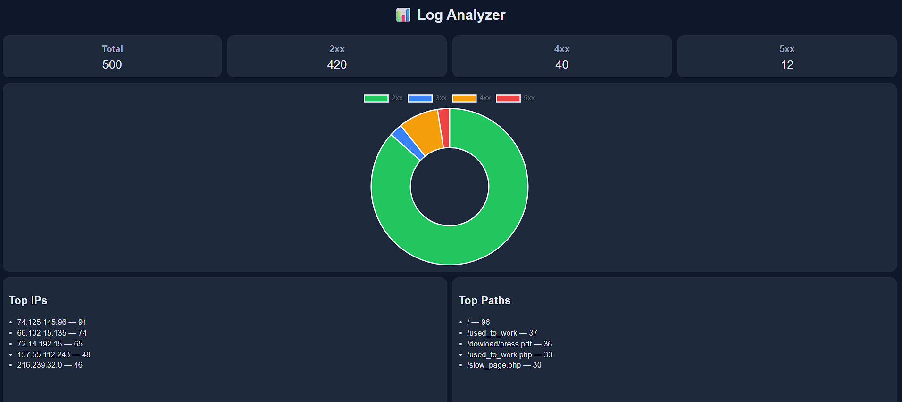

# 📊 Log Analyzer Dashboard

A lightweight **log analysis and visualization tool** built with Python and Flask.  
This project parses raw Apache-style logs, extracts meaningful insights, and displays them in a clean, single-page dashboard.

---

## 🚀 Features

- 📂 Parse real-world Apache access logs  
- 📊 Aggregate key metrics:
  - Total requests
  - Status code distribution (2xx, 3xx, 4xx, 5xx)
- 🌐 Identify:
  - Top IP addresses
  - Most accessed endpoints
- 📈 Interactive visualization using Chart.js  
- 🎯 Single-page dashboard (no scrolling, clean UI)

---

## 🖼️ Dashboard Preview

